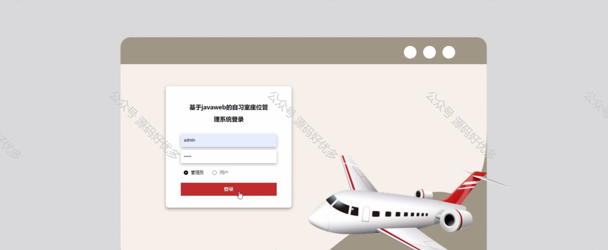

 
## 查看主页获取源码

### 一、作品包含

源码+数据库+设计文档万字+PPT+全套环境和工具资源+部署教程

### 二、项目技术

前端技术：Html、Css、Js、Vue、Element-ui

数据库：MySQL

后端技术：Java、Spring Boot、MyBatis

  

### 三、运行环境

开发工具：IDEA/eclipse

数据库：MySQL5.7

数据库管理工具：Navicat10以上版本

环境配置软件： JDK1.8+Maven3.6.3

前端Nodejs：14

### 四、项目介绍
项目编号：springbootA236

自习室座位管理系统在现代教育及公共学习环境中扮演着重要角色，它应对了人们对安静学习空间的需求与有限资源之间的矛盾。该系统的出现，标志着自习室管理向智能化、便捷化方向的转变，旨在提升自习室的使用体验，保障学习秩序，同时也为管理者提供了更为科学的管理手段。

前台用户功能：浏览首页、自习室座位、系统公告、后台管理、投诉反馈和个人中心。

后台分为管理员和用户
管理员的功能：首页、个人中心、用户管理、自习室座位管理、座位预约管理、计时统计管理和系统管理。
用户的功能：首页、个人中心、座位预约管理、计时统计管理。

### 五、运行截图

  
